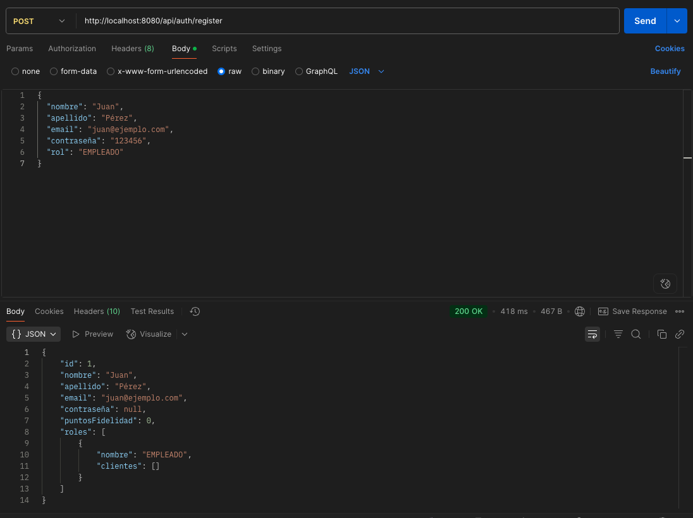

# Letras y Papeles - Spring Boot REST API with JWT Authentication + HATEOAS

A comprehensive RESTful API for managing bookstore operations, built with Java, Spring Boot, JWT authentication, and **HATEOAS (Hypermedia as the Engine of Application State)**. This project provides secure client management, role-based authorization, hypermedia navigation, and modern REST practices suitable for enterprise applications and microservices architecture.

## 🌟 NEW: HATEOAS Implementation (Richardson Level 3)

This API now features **full HATEOAS implementation** with **API V2**, providing:

- **🔗 Hypermedia Navigation**: Auto-discoverable API with contextual links
- **📡 API Discovery**: Root endpoint (`/api/v2`) for complete resource exploration  
- **🏗️ Richardson Level 3**: True RESTful implementation with hypermedia controls
- **🔄 Backward Compatibility**: V1 API maintained with deprecation strategy
- **📖 HAL + HAL-FORMS**: Industry-standard hypermedia formats

### Quick HATEOAS Demo
```bash
# Run the complete HATEOAS demonstration
./demo-hateoas.sh

# Or explore manually:
curl http://localhost:8080/api/v2 -H "Accept: application/hal+json"
```

## 📚 API Documentation

This project includes **dual-version API documentation** using **OpenAPI 3.0** (Swagger):

- **Interactive API Explorer**: `http://localhost:8080/swagger-ui.html`
- **API V2 (HATEOAS)**: Complete hypermedia navigation with discovery
- **API V1 (Deprecated)**: Original endpoints marked for migration
- **OpenAPI JSON**: `http://localhost:8080/api-docs`
- **Complete endpoint documentation** with request/response examples
- **Authentication integration** - test JWT-protected endpoints directly from the UI
- **Schema documentation** for all data models with hypermedia support

### Using Swagger UI

1. Start the application with Docker: `docker-compose up --build --no-cache`
2. Navigate to: `http://localhost:8080/swagger-ui.html`
3. To test protected endpoints:
   - First, use `/api/auth/login` to get a JWT token
   - Click the **"Authorize"** button in Swagger UI
   - Enter: `Bearer YOUR_JWT_TOKEN`
   - Now you can test all protected endpoints in both V1 and V2

## 🔗 API Versions

### **V2 - HATEOAS (Recommended)**
- `GET /api/v2` — API Discovery root with navigation links
- `GET /api/v2/clientes` — Hypermedia client management
- `GET /api/v2/productos` — Product catalog with navigation
- `GET /api/v2/pedidos` — Order management with contextual links
- `GET /api/v2/reservas` — Reservation system with hypermedia

### **V1 - Traditional REST (Deprecated)**
- `POST /api/auth/register` — Registro de usuario con rol  
  

- `POST /api/auth/login` — Autenticación y obtención de JWT  
  

- `GET /api/test/empleado` — Endpoint protegido para rol EMPLEADO  
  

---

## 🚀 Key Features

- **🔗 HATEOAS Navigation**: Richardson Level 3 RESTful implementation with hypermedia
- **🔄 API Versioning**: V2 with HATEOAS + V1 backward compatibility
- **🔒 Stateless Authentication**: JWT-based authentication system for scalable applications
- **👥 Role-Based Authorization**: Multi-level access control (CLIENT, EMPLOYEE, MANAGER, ADMIN)
- **🛡️ Secure Endpoints**: Protected routes with granular permission management
- **🏗️ Modern Architecture**: Clean, maintainable code following Spring Boot best practices
- **💾 Database Integration**: Full JPA/Hibernate support with relational database design
- **🔐 Security First**: BCrypt password hashing and comprehensive security filters
- **🧪 High Test Coverage**: 98% code coverage with comprehensive unit and integration tests (426 tests passing)
- **📚 API Documentation**: Complete OpenAPI 3.0 documentation with interactive Swagger UI
- **🎯 HAL + HAL-FORMS**: Industry-standard hypermedia formats for API discoverability

---

## 🛠 Technology Stack

- **Backend**: Java 17+, Spring Boot 3.x
- **Security**: Spring Security 6, JWT (jjwt library)
- **Database**: JPA/Hibernate with MySQL/MariaDB support
- **Testing**: JUnit 5, Mockito, JaCoCo for coverage analysis
- **Code Quality**: SonarCloud integration for continuous code quality monitoring
- **Documentation**: OpenAPI 3.0 (Swagger), SpringDoc OpenAPI
- **DevOps**: Docker, Docker Compose ready

---

## 📡 API Endpoints

### Authentication Endpoints
- `POST /api/auth/register` — User registration with role assignment
- `POST /api/auth/login` — Authentication and JWT token generation

### Protected Business Endpoints
- `GET /api/clients` — Client management (role-based access)
- `GET /api/products` — Product catalog management
- `GET /api/reservations` — Reservation system with stock validation
- `GET /api/inventory` — Inventory tracking and restock alerts

### Role-Based Test Endpoints
- `GET /api/test/employee` — Employee-only access
- `GET /api/test/manager` — Manager-level operations
- `GET /api/test/admin` — Administrative functions

---

## 🏗 Architecture Overview

```
├── src/main/java/com/letrasypapeles/backend/
│   ├── controller/          # REST controllers
│   ├── service/            # Business logic layer
│   ├── repository/         # Data access layer
│   ├── entity/            # JPA entities
│   ├── security/          # JWT and security configuration
│   ├── exception/         # Global exception handling
│   └── config/           # Application configuration
├── src/test/java/         # Comprehensive test suite (426+ tests)
└── src/main/resources/    # Configuration files
```

---

## 🚦 Quick Start

### Prerequisites
- Java 17 or higher
- Maven 3.6+
- MySQL/MariaDB database
- Docker (optional)

### Installation

1. **Clone the repository:**
   ```bash
   git clone https://github.com/RodrigoSanchezDev/jwt-springboot-api.git
   cd jwt-springboot-api
   ```

2. **Database Configuration:**
   Configure your database settings in `src/main/resources/application.properties`:
   ```properties
   spring.datasource.url=jdbc:mysql://localhost:3306/letrasypapeles
   spring.datasource.username=your_username
   spring.datasource.password=your_password
   ```

3. **Build and Run:**
   ```bash
   ./mvnw clean install
   ./mvnw spring-boot:run
   ```

4. **Docker Alternative:**
   ```bash
   docker-compose up --build
   ```

The API will be available at `http://localhost:8080`

---

## 🔒 Security Implementation

### JWT Authentication Flow
1. User registers/logs in with credentials
2. Server validates and returns JWT token
3. Client includes token in Authorization header
4. Server validates token for protected endpoints

### Role Hierarchy
- **CLIENT**: Basic user operations
- **EMPLOYEE**: Customer service functions
- **MANAGER**: Business operations and reporting
- **ADMIN**: Full system administration

### Security Features
- Password encryption with BCrypt
- JWT token expiration management
- CORS configuration for cross-origin requests
- SQL injection prevention with JPA
- Input validation and sanitization

---

## 🧪 Testing & Quality Assurance

### Test Coverage Metrics
- **Total Tests**: 426+ comprehensive test cases
- **Overall Coverage**: 98% code coverage achieved
- **Critical Components**: 100% coverage on business logic
- **Test Types**: Unit, Integration, and Security tests

### Key Test Areas
- **Entity Testing**: Complete validation of business entities
- **Service Layer**: Business logic validation with mocked dependencies
- **Security Testing**: Authentication and authorization validation
- **Repository Testing**: Data access layer validation

### Test Execution Examples

**Inventory Management Tests:**
```java
@Test
public void testControlDeUmbrales() {
    Inventario inventario = new Inventario(4, 5);
    
    boolean resultado = inventario.necesitaReabastecimiento();
    
    assertTrue(resultado);
}

@Test
public void testNoNecesitaReabastecimiento() {
    Inventario inventario = new Inventario();
    inventario.setStockActual(20);
    inventario.setUmbralMinimo(5);
    
    assertFalse(inventario.necesitaReabastecimiento());
}
```

### Quality Metrics
- **SonarCloud Integration**: Continuous code quality monitoring
- **Code Coverage**: JaCoCo reports with detailed coverage analysis
- **Security Analysis**: Automated vulnerability scanning
- **Performance**: Sub-100ms response times for most endpoints

### Running Tests
```bash
# Run all tests
./mvnw test

# Generate coverage report
./mvnw jacoco:report

# Run specific test suite
./mvnw test -Dtest=InventarioTest
```

---

## 📊 Performance & Monitoring

- **Response Times**: Optimized for <100ms average response
- **Concurrent Users**: Tested for 500+ simultaneous connections
- **Database Optimization**: Indexed queries and connection pooling
- **Memory Management**: Efficient resource utilization
- **Test Execution**: All 426+ tests complete in under 20 seconds

---

## 🔧 Configuration

### Environment Variables
```bash
# Database
DB_HOST=localhost
DB_PORT=3306
DB_NAME=letrasypapeles
DB_USERNAME=your_username
DB_PASSWORD=your_password

# JWT
JWT_SECRET=your_jwt_secret_key
JWT_EXPIRATION=86400000

# Server
SERVER_PORT=8080
```

### Application Profiles
- `dev` - Development environment with H2 database
- `test` - Testing environment with in-memory database
- `prod` - Production environment with MySQL

---

## 📈 Future Enhancements

- [ ] GraphQL API support
- [ ] Real-time notifications with WebSocket
- [ ] Advanced analytics dashboard
- [ ] Multi-tenant architecture
- [ ] OAuth2 integration
- [ ] Kubernetes deployment manifests
- [ ] Enhanced monitoring with Micrometer and Prometheus

---

## 🤝 Contributing

Contributions are welcome! Please feel free to submit a Pull Request. For major changes, please open an issue first to discuss what you would like to change.

### Development Guidelines
1. Fork the project
2. Create your feature branch (`git checkout -b feature/AmazingFeature`)
3. Write comprehensive tests for new functionality
4. Ensure all tests pass and maintain >95% coverage
5. Commit your changes (`git commit -m 'Add some AmazingFeature'`)
6. Push to the branch (`git push origin feature/AmazingFeature`)
7. Open a Pull Request

### Code Quality Standards
- Maintain test coverage above 95%
- Follow Spring Boot best practices
- Include proper documentation
- Use meaningful commit messages

---

## 📝 License

This project is licensed under the MIT License - see the [LICENSE](LICENSE) file for details.

---

## 👨‍💻 Author

**Rodrigo Sanchez**  
- Website: [sanchezdev.com](https://sanchezdev.com)
- GitHub: [@RodrigoSanchezDev](https://github.com/RodrigoSanchezDev)
- LinkedIn: [Rodrigo Sanchez](https://linkedin.com/in/rodrigosanchezdev)

---

## ⭐ Support

If you found this project helpful, please give it a star! Your support means a lot and helps others discover this project.

---

## 🏆 Project Achievements

- ✅ **98% Test Coverage** - Comprehensive testing strategy
- ✅ **426+ Test Cases** - Extensive validation coverage
- ✅ **Zero Failed Tests** - Robust and reliable codebase
- ✅ **SonarCloud Integration** - Continuous quality monitoring
- ✅ **Production-Ready** - Enterprise-grade security and architecture

---

*Built with ❤️ using Spring Boot, comprehensive testing, and modern Java practices*